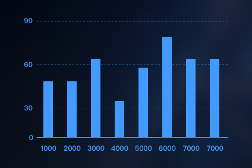
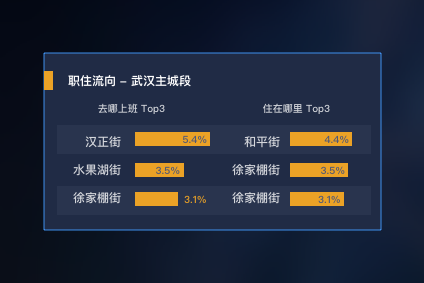
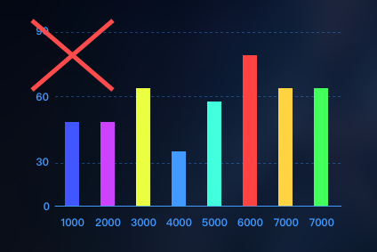
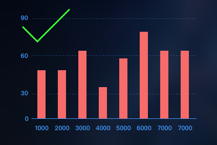
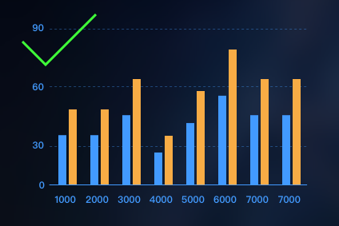

# 色彩
---

###界面色彩

<div class ="bg">
	<div class = "container">
		<div class="card standardBlue">
			<p>标准蓝</p>
			<div class="colorCardFooter">
				<p>#429AFF <br> RGB 66,154,255</p>
			</div>
		</div>
		<div class = "cardPara">
			<p class="cardParaTitle"><strong >标准蓝色</strong></p>
			<p>产品标准色，主产品蓝色色调以此为主。</p>
			<p> 个性化产品可能有不同主题色，保持一致性即可。</p>
		</div>
		<div class = "card"></div>
		<div class = "card"></div>
	</div>
	<div class = "container">
		<div class="card boxFrame">
			<p>border: 1px solid #429AFF;</p>
			<p>	color: #429AFF;</p>
		</div>
		<div class="cardPara">
			<p class="cardParaTitle"><strong >组件框</strong></p>
			<p>功能组件默认边框。</p>
		</div>
		<div class="card homePanel">
			<p>	border: 1px solid #429AFF;</p>
			<p>	color: rgba(255,255,255,0.8);</p>
			<p>	background: rgba(32,44,69,0.9);</p>
		</div>
		<div class="cardPara">
			<p class="cardParaTitle"><strong >首页面板</strong></p>
			<p>首页地图上半透明浮层，用于首页数据和表格展示。</p>
		</div>		
	</div>
	<div class = "container">
		<div class="card solidPanel">
			<p>border: 1px solid #429AFF;</p>
			<p>	color: #429AFF;</p>
			<p>	background: #1B243B;</p>
		</div>
		<div class="cardPara">
			<p class="cardParaTitle"><strong>菜单面板</strong></p>
			<p>下拉菜单，提示框（无边框）</p>
		</div>
		<div class="card mapPanel">
			<p>	border: none;</p>
			<p>	color: rgba(255,255,255,0.8); </p>
			<p>background: rgba(25,68,106, 0.8);</p>
		</div>
		<div class="cardPara ">
			<p class="cardParaTitle"><strong >地图面板</strong></p>
			<p>地图上半透明浮层，多用于数据可视化图例展示和调节。</p>
		</div>
	</div>
</div>   

<div class ="bg">
	<div class = "container">
		<div class="card boxFrame buttonFrame">
			<button class="buttonPrimary">启动查询</button>
			<button class="buttonLine">添加</button>
		</div>
		<div class="cardPara">
			<p class="cardParaTitle"><strong >按钮</strong></p>
			<p>产品按钮，分为主按钮和次按钮（幽灵按钮）</p>
		</div>
		<div class = "card"></div>
		<div class = "card"></div>
	</div>
</div>

```css
.buttonPrimary{
	background-color: #2E75B3;
	color: white;
	font-size: 14px;
	font-family: sans-serif;
	font-weight: 600;
	border: none;
	width: 84px;
	height: 28px;
	padding-top: 4px;
	transition: .2s;
	margin: 0 auto 24px auto;
	outline:none;
}

.buttonPrimary:hover{
	color: white;
	background-color: #429AFF;
	transition: .2s;
}

.buttonPrimary:active{
	color: white;
	background-color: #2E75B3;
}


.buttonLine{
	color: #429AFF;
	background-color: transparent;
	font-size: 14px;
	font-family: sans-serif;
	font-weight: 600;
	border: #429AFF 1px solid;
	width: 84px;
	height: 28px;
	padding-top: 4px;
	transition: .2s;
	margin: 0 auto 0 auto;
	outline:none;
}

.buttonLine:hover{
	color:white;
	background-color: #429AFF;
	transition: .2s;
}

.buttonLine:active{
	color: white;
	background-color: #2E75B3;
}
```


###数据可视化色彩

#####数据图表

柱状图





柱状图颜色根据设计情景而定，默认为标准蓝色。
图表避免使用过于鲜艳，饱和度过高的颜色。  
可参考: [Material Color](https://material.io/guidelines/style/color.html#color-color-palette)


<div>
	
	
	
	<p style="color:red">*同一类数据使用同一种颜色，不同类型／来源数据使用不同颜色</p>
</div>

<br>

<!-- 饼图

方块图 -->

<!-- 明细列表 -->


#####色阶：双向色阶

<div class="colorScale">
	<div style="background-color: #3B66E9;"></div>
	<div style="background-color: #9296E9;"></div>
	<div style="background-color: #CCC9E4;"></div>
	<div style="background-color: #FFFFDD;"></div>
	<div style="background-color: #FFC1A2;"></div>
	<div style="background-color: #FF806D;"></div>
	<div style="background-color: #E4434E;"></div>
</div>

<div class="colorScale">
	<div >#3B66E9</div>
	<div >#9296E9</div>
	<div >#CCC9E4</div>
	<div >#FFFFDD</div>
	<div >#FFC1A2</div>
	<div >#FF806D</div>
	<div >#E4434E</div>
</div>

<div class="colorScale">
	<div style="background-color: #3B66E9;"></div>
	<div style="background-color: #9F9FE7;"></div>
	<div style="background-color: #E0D7ED;"></div>
	<div style="background-color: #FFDCBE;"></div>
	<div style="background-color: #F79584;"></div>
	<div style="background-color: #E4434E;"></div>
</div>

<div class="colorScale">
	<div >#3B66E9</div>
	<div >#9F9FE7</div>
	<div >#E0D7ED</div>
	<div >#FFDCBE</div>
	<div >#F79584</div>
	<div >#E4434E</div>
</div>

<div class="colorScale">
	<div style="background-color: #3B66E9;"></div>
	<div style="background-color: #B1AFE6;"></div>
	<div style="background-color: #FFFFDD;"></div>
	<div style="background-color: #FAA792;"></div>
	<div style="background-color: #E4434E;"></div>
</div>

<div class="colorScale">
	<div >#3B66E9</div>
	<div >#B1AFE6</div>
	<div >#FFFFDD</div>
	<div >#FAA792</div>
	<div >#E4434E</div>
</div>

<div class="colorScale">
	<div style="background-color: #3B66E9;"></div>
	<div style="background-color: #CDC9E3;"></div>
	<div style="background-color: #FEC5AA;"></div>
	<div style="background-color: #E4434E;"></div>
</div>

<div class="colorScale">
	<div >#3B66E9</div>
	<div >#CDC9E3</div>
	<div >#FEC5AA</div>
	<div >#E4434E</div>
</div>

<div class="colorScale">
	<div style="background-color: #3B66E9;"></div>
	<div style="background-color: #FFFFDD;"></div>
	<div style="background-color: #E4434E;"></div>
</div>

<div class="colorScale">
	<div >#3B66E9</div>
	<div >#FFFFDD</div>
	<div >#E4434E</div>
</div>

#####单向色阶

红

<div class="colorScale">
	<div style="background-color: #E4434E;"></div>
	<div style="background-color: #ED6864;"></div>
	<div style="background-color: #F5887A;"></div>
	<div style="background-color: #FAA792;"></div>
	<div style="background-color: #FEC5AA;"></div>
	<div style="background-color: #FFE2C4;"></div>
	<div style="background-color: #FFFFDD;"></div>
</div>

<div class="colorScale">
	<div >#E4434E</div>
	<div >#ED6864</div>
	<div >#F5887A</div>
	<div >#FAA792</div>
	<div >#FEC5AA</div>
	<div >#FFE2C4</div>
	<div >#FFFFDD</div>
</div>

<div class="colorScale">
	<div style="background-color: #E4434E;"></div>
	<div style="background-color: #EF6E68;"></div>
	<div style="background-color: #F79583;"></div>
	<div style="background-color: #FDB8A0;"></div>
	<div style="background-color: #FFDDBF;"></div>
	<div style="background-color: #FFFFDD;"></div>
</div>

<div class="colorScale">
	<div >#E4434E</div>
	<div >#EF6E68</div>
	<div >#F79583</div>
	<div >#FDB8A0</div>
	<div >#FFDDBF</div>
	<div >#FFFFDD</div>
</div>

<div class="colorScale">
	<div style="background-color: #E4434E;"></div>
	<div style="background-color: #F1786F;"></div>
	<div style="background-color: #FAA792;"></div>
	<div style="background-color: #FFD3B7;"></div>
	<div style="background-color: #FFFFDD;"></div>
</div>

<div class="colorScale">
	<div >#E4434E</div>
	<div >#F1786F</div>
	<div >#FAA792</div>
	<div >#FFD3B7</div>
	<div >#FFFFDD</div>
</div>

<div class="colorScale">
	<div style="background-color: #E4434E;"></div>
	<div style="background-color: #F5887A;"></div>
	<div style="background-color: #FEC5AA;"></div>
	<div style="background-color: #FFFFDD;"></div>
</div>

<div class="colorScale">
	<div >#E4434E</div>
	<div >#F5887A</div>
	<div >#FEC5AA</div>
	<div >#FFFFDD</div>
</div>

<div class="colorScale">
	<div style="background-color: #E4434E;"></div>
	<div style="background-color: #FAA792;"></div>
	<div style="background-color: #FFFFDD;"></div>
</div>

<div class="colorScale">
	<div >#E4434E</div>
	<div >#FAA792</div>
	<div >#FFFFDD</div>
</div>

蓝

<div class="colorScale">
	<div style="background-color: #3B66E9;"></div>
	<div style="background-color: #707DE8;"></div>
	<div style="background-color: #9396E7;"></div>
	<div style="background-color: #B1AFE6;"></div>
	<div style="background-color: #CDC9E3;"></div>
	<div style="background-color: #E6E1EC;"></div>
	<div style="background-color: #FFFFDD;"></div>
</div>

<div class="colorScale">
	<div >#3B66E9</div>
	<div >#707DE8</div>
	<div >#9396E7</div>
	<div >#B1AFE6</div>
	<div >#CDC9E3</div>
	<div >#E6E1EC</div>
	<div >#FFFFDD</div>
</div>

<div class="colorScale">
	<div style="background-color: #3B66E9;"></div>
	<div style="background-color: #7782E8;"></div>
	<div style="background-color: #A0A0E7;"></div>
	<div style="background-color: #C2BEE4;"></div>
	<div style="background-color: #D8D3DF;"></div>
	<div style="background-color: #FFFFDD;"></div>
</div>

<div class="colorScale">
	<div >#3B66E9</div>
	<div >#7782E8</div>
	<div >#A0A0E7</div>
	<div >#C2BEE4</div>
	<div >#D8D3DF</div>
	<div >#FFFFDD</div>
</div>

<div class="colorScale">
	<div style="background-color: #3B66E9;"></div>
	<div style="background-color: #828AE8;"></div>
	<div style="background-color: #B1AFE6;"></div>
	<div style="background-color: #DAD7E2;"></div>
	<div style="background-color: #FFFFDD;"></div>
</div>

<div class="colorScale">
	<div >#3B66E9</div>
	<div >#828AE8</div>
	<div >#B1AFE6</div>
	<div >#DAD7E2</div>
	<div >#FFFFDD</div>
</div>

<div class="colorScale">
	<div style="background-color: #3B66E9;"></div>
	<div style="background-color: #9396E7;"></div>
	<div style="background-color: #CDC9E3;"></div>
	<div style="background-color: #FFFFDD;"></div>
</div>

<div class="colorScale">
	<div >#3B66E9</div>
	<div >#9396E7</div>
	<div >#CDC9E3</div>
	<div >#FFFFDD</div>
</div>

<div class="colorScale">
	<div style="background-color: #3B66E9;"></div>
	<div style="background-color: #B1AFE6;"></div>
	<div style="background-color: #FFFFDD;"></div>
</div>

<div class="colorScale">
	<div >#3B66E9</div>
	<div >#B1AFE6</div>
	<div >#FFFFDD</div>
</div>

可视化色阶生成工具：[Color Scale Helper](http://gka.github.io/palettes/#), [HSV Colors](https://www.vis4.net/blog/posts/avoid-equidistant-hsv-colors/)


<style>

*{
	box-sizing: border-box;
}

.bg{
	background-image: url("../img/bgBlur.png");
	width:100%;
	height: auto;
	padding: 1px;
	background-size: cover;
	background-position: center;
	margin-bottom: 30px; 
}

.container{
	margin: 60px auto;
	height: auto;
	width: 90%;
	display: flex;
	justify-content:space-between;
	/*border:1px red solid;*/
}

.card{
	width: 21%;
	height: 210px;
	padding: 20px 18px;
	position: relative;
	font-family: sans-serif;
	font-weight: 800;
	font-size: 13px;
	line-height: 18px;
	/*border: red 1px solid;*/
}
.colorCardFooter{
	opacity: 0.7;
	bottom: 15px;
	position: absolute;
}

.standardBlue{
	background-color: #429AFF;
	color: white;
}

.boxFrame{
	border: 1px solid #429AFF;
	color: #429AFF;
}

.solidPanel{
	background: #1B243B;
	border: 1px solid #429AFF;
	color: #429AFF;
}

.selectedArea{
	background: rgba(51,160,255,0.40);
	border: 4px solid #429AFF;
}

.cardPara{
	margin-left: -16px;
	color: white;
	width: 21%;
	font-family: sans-serif;
	font-size: 12px;
	font-weight: 600;
	line-height: 18px;
	color: rgba(255,255,255,0.9);
	padding-top: 20px;
	/*border: 1px red solid;*/
}

.cardParaTitle{
	font-size: 18px;
}


.mapPanel{
	border: none;
	color: rgba(255,255,255,0.8);
	background: rgba(35,78,128,0.8);
}

.homePanel{
	border: 1px solid #429AFF;
	background: rgba(32,43,69,0.9);
	color: rgba(255,255,255,0.8);
}

.buttonFrame{
	text-align:center;
	border: none;
	height:auto;
}

.buttonPrimary{
	display: block;
	background-color: #2E75B3;
	color: white;
	font-size: 14px;
	font-family: sans-serif;
	font-weight: 600;
	border: none;
	width: 84px;
	height: 28px;
	padding-top: 4px;
	transition: .2s;
	margin: 0 auto 24px auto;
	outline:none;
}

.buttonPrimary:hover{
	color: white;
	background-color: #429AFF;
	transition: .2s;
}

.buttonPrimary:active{
	color: white;
	background-color: #2E75B3;
}


.buttonLine{
	display: block;
	color: #429AFF;
	background-color: transparent;
	font-size: 14px;
	font-family: sans-serif;
	font-weight: 600;
	border: #429AFF 1px solid;
	width: 84px;
	height: 28px;
	padding-top: 4px;
	transition: .2s;
	margin: 0 auto 0 auto;
	outline:none;
}

.buttonLine:hover{
	color:white;
	background-color: #429AFF;
	transition: .2s;
}

.buttonLine:active{
	color: white;
	background-color: #2E75B3;
}

.colorScale{
	display: flex;
	margin-bottom: 20px;
}

.colorScale > div {
	flex: 1;
	height: 40px;
	font-size: 14px;
	font-weight: 600;
	color:#5C5C5C;
	text-align: center;
}

.chartImg{
	margin: 5px;
	width: 45%;
}
</style>


