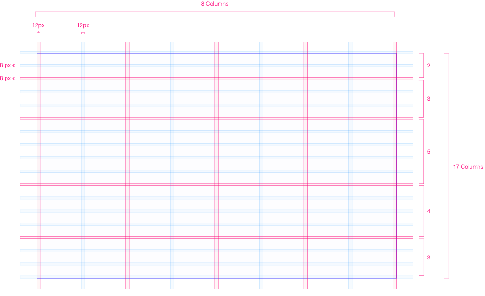
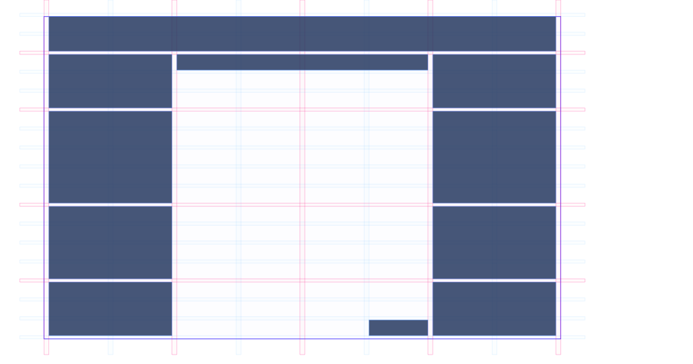
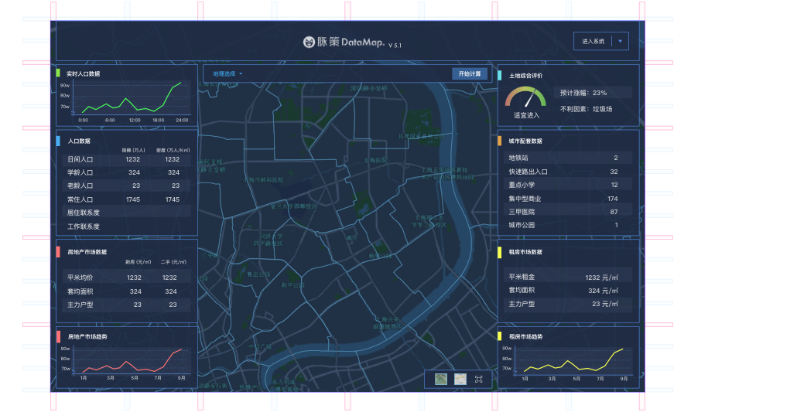
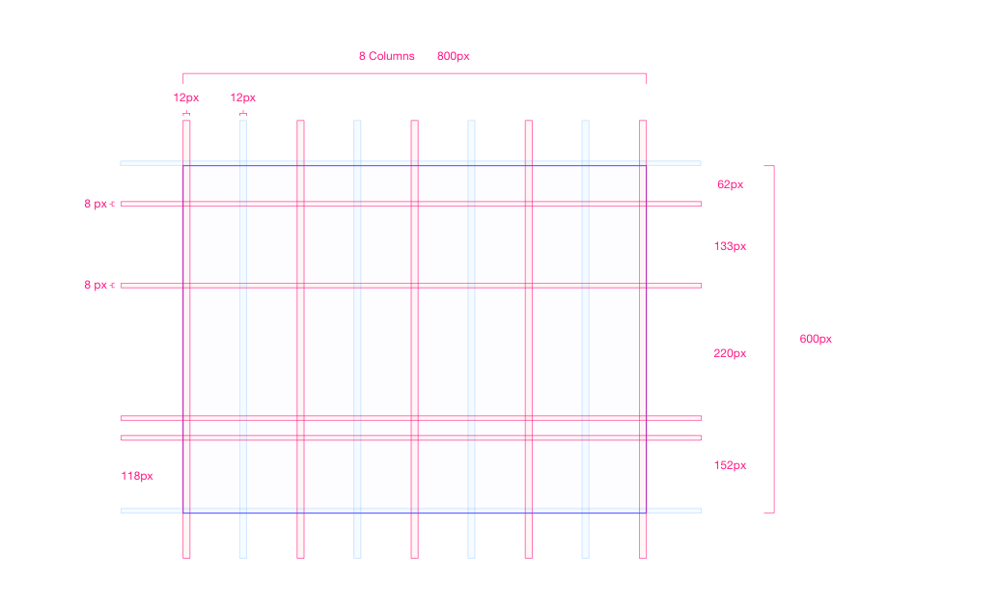
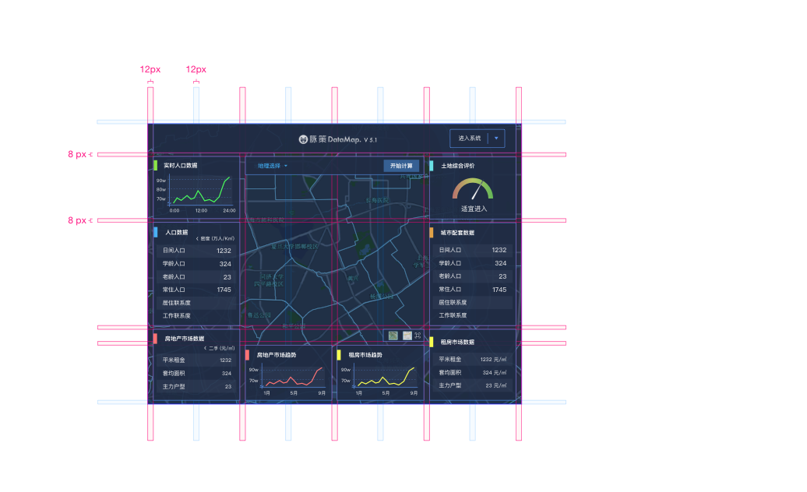
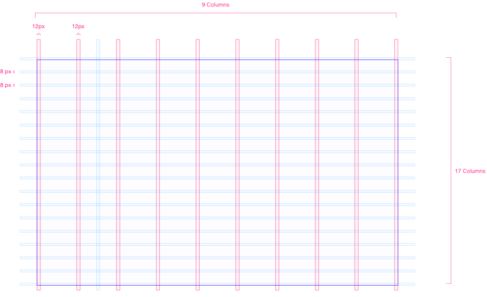
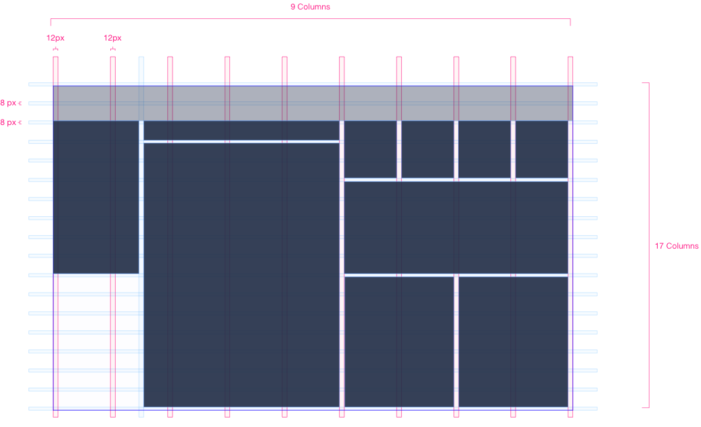
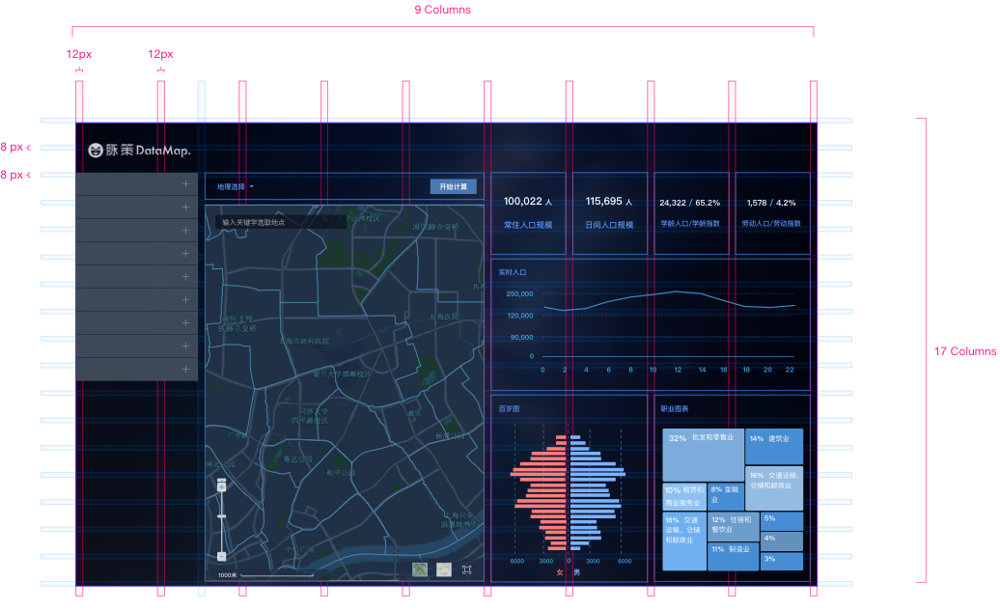
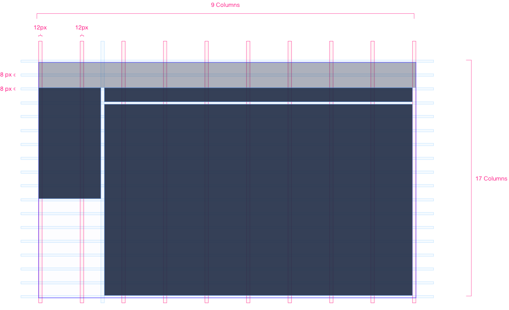
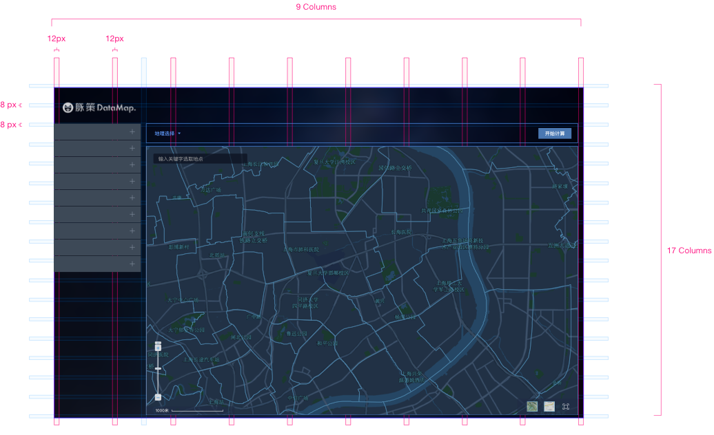

# 界面布局
---
###设计基准屏幕大小

标准尺寸：  1280px 800px  
大屏尺寸：  1920px 1080px  
投影仪尺寸： 800px 600px  

###网格系统
主要用于在产品快速设计时的页面布局和排版参考，使产品设计更加有一致性。

####首页网格

网格骨架 （1280*800）

页面布局  

完成图  

网格骨架 （800*600 投影仪屏幕）

页面布局  

完成图  

####内部网格
网格骨架

页面布局 1

完成图 1

页面布局 2

完成图 2

